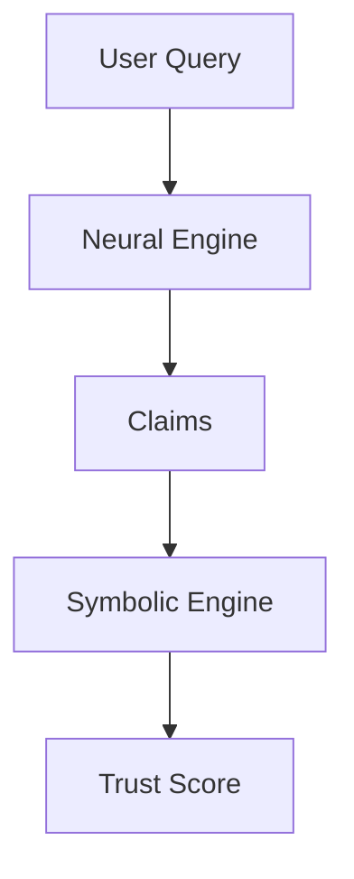

# Trustworthy Financial Agent (Neuro-Symbolic AI)

This project implements a "Trustworthy Financial Agent" combining a Neural Engine (Llama 3) for analysis and a Symbolic Engine for logic verification.

## Architecture



## Structure

- **/neural_engine**: Contains the LLM interface (Llama 3).
- **/symbolic_engine**: Contains the logic rule checker.
- **/orchestrator**: Main application entry point.
- **/data**: Data storage.
- **/tests**: Unit and architecture tests.

## Setup

1. Install requirements:
   ```bash
   pip install -r requirements.txt
   ```

2. Run the orchestrator:
   ```bash
   python orchestrator/main.py
   ```
