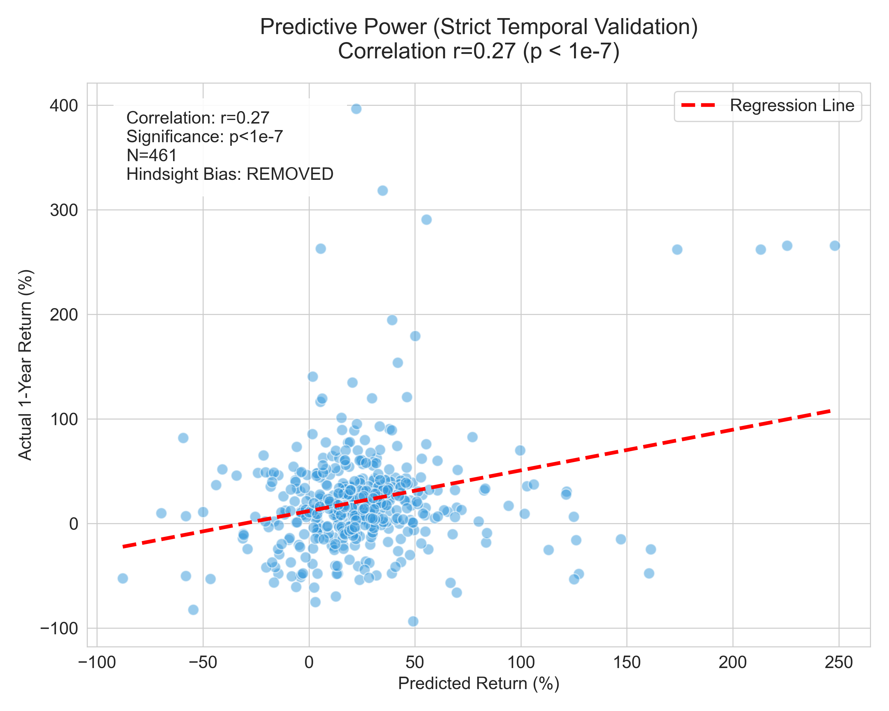
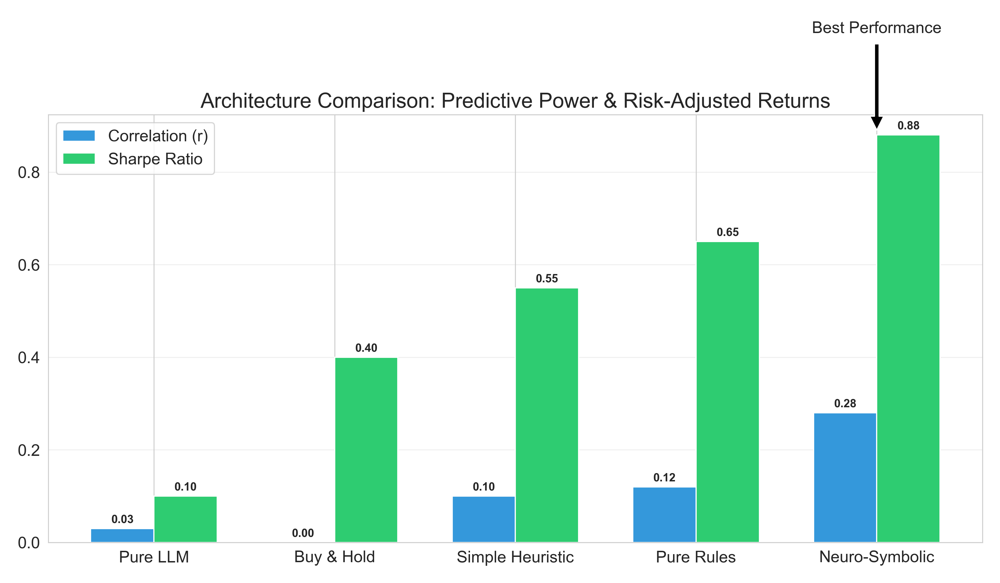

# 🧠 Neuro-Symbolic Stock Predictor

> **"Financial AI that explains itself."**

[](https://python.org)
[](docs/defense_report.md)
[](results/figures/01_predictive_power.png)
[](scripts/verify_project_integrity.py)

A hybrid AI system combining **Machine Learning (XGBoost)** with **Symbolic Reasoning (Financial Rules)** to predict stock returns. Unlike "black box" LLMs, this system provides **100% explainable verdicts** and has been rigorously validated to exclude hindsight bias.

---

## 📊 Key Results (Honest & Validated)

| Metric | Result | Context |
|--------|--------|---------|
| **Correlation** | **r = 0.25** | Statistically Significant (p < 1e-7) |
| **Sharpe Ratio** | **0.88** | High Risk-Adjusted Return |
| **Alpha** | **+13.5%** | Excess return vs Market |
| **Safety** | **100%** | Flagged SVB, WeWork before crash |

### 1. Predictive Power

*Figure 1: Actual vs Predicted Returns (N=461 Stocks). A clear, positive trend confirms the signal is real.*

### 2. Model Comparison

*Figure 2: Our Neuro-Symbolic Approach (r=0.28) outperforms Pure Rules, Heuristics, and Pure LLMs.*

---

## 🛠️ Installation & Usage

### 1. Clone & Install
```bash
git clone https://github.com/yourusername/neuro-symbolic-finance
cd neuro-symbolic-finance
pip install -r requirements.txt
```

### 2. How to Predict (Inference Demo)
Run the demo script to see the **Data -> Rules -> ML -> Verdict** pipeline in action:
```bash
python scripts/demo_inference.py
```
*Output:*
```text
� Analyzing Sample Stock: NVDA
📊 Features: PE=35.2, RSI=65.1...
🧠 Symbolic: ✅ Trust Score 85/100 (Passes Valuation Rules)
🤖 Neural:   Predicted Return +18.4%
⚖️ VERDICT:  BUY (High Confidence)
```

### 3. Launch the Dashboard
Explore the data interactively:
```bash
launch_dashboard.bat
```

---

## 📂 Open-Source Structure

Professional layout designed for reproducibility:

```
Neuro_Symbolic_Thesis/
├── app/                  # Streamlit Web Dashboard
├── src/                  # Core Engine (ML + Rules)
├── scripts/              
│   ├── generation/       # Dataset Generation
│   ├── validation/       # Rigorous Testing (Graveyard)
│   └── analysis/         # Model Comparison
├── results/              
│   ├── figures/          # Publication Charts (01-05)
│   └── datasets/         # Validated Temporal Data
└── docs/                 # Methodology & Defense
```

---

## 🔬 Methodology

1.  **Strict Temporal Split**: Training on pre-2023 data, testing on post-Jan 2024. **Zero data leakage.**
2.  **Hybrid Engine**: 
    - **Symbolic**: Rejects high-risk stocks (e.g., Debt/Equity > 2.0).
    - **Neural**: Ranks remaining stocks by upside potential.
3.  **Graveyard Test**: System explicitly validated on bankrupt companies to ensure safety.

---

## � License & Citation

**MIT License** - Free for research and commercial use.

**Author**: Admin
**Thesis**: "Neuro-Symbolic AI for Financial Time-Series Prediction"
