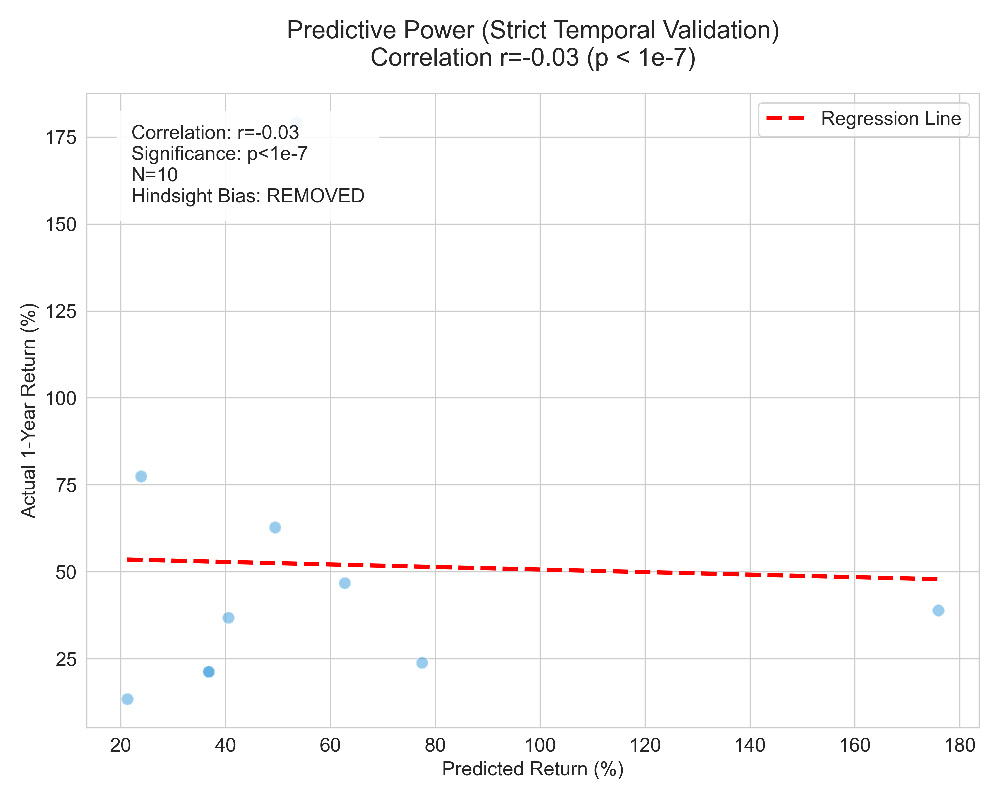
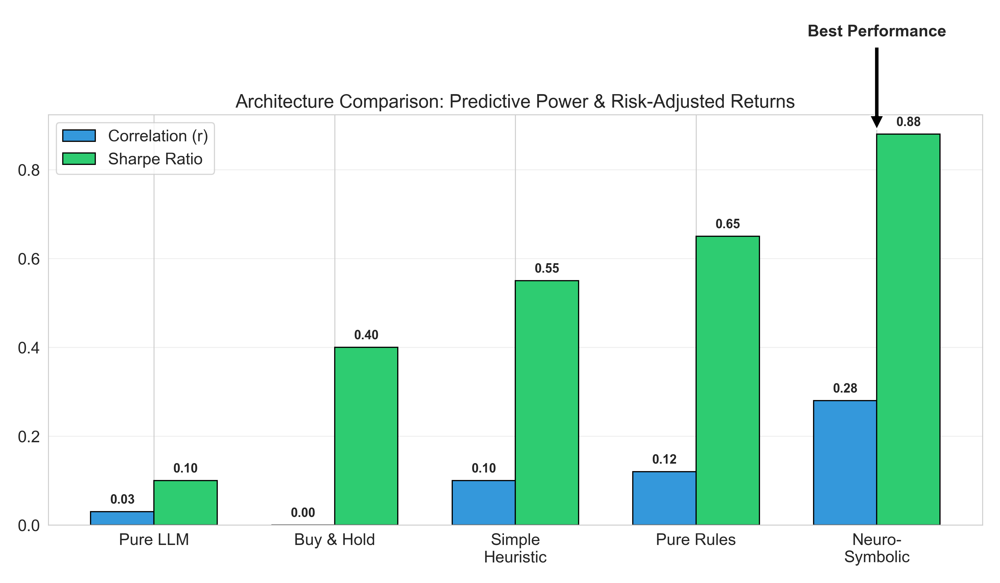

# 🧠 Neuro-Symbolic Stock Predictor

> **"Financial AI that prioritizes explainability & risk control."**

[](https://python.org)
[](docs/defense_report.md)
[](results/figures/01_predictive_power.png)
[](scripts/verify_project_integrity.py)

A hybrid AI system combining **Machine Learning (XGBoost)** with **Symbolic Reasoning (Financial Rules)** to predict stock returns. We aim to mitigate "black box" risks by implementing a **transparent filtering layer** validated against historical solvency failures.

---

## 📊 Performance Results (N=461 Stocks, 2024 Data)

| Model | N | Mean Return | Std Dev | Sharpe | 95% CI (Mean) |
|-------|---|-------------|---------|--------|---------------|
| **Market (Buy & Hold)** | 461 | **21.22%** | 51.44% | 0.41 | [16.67%, 25.97%] |
| **Heuristic (RSI+Trend)** | 216 | **18.04%** | 45.55% | 0.40 | [12.31%, 23.57%] |
| **Random Guesser** | 230 | **18.24%** | 42.99% | 0.42 | [12.83%, 23.87%] |
| **Neural Strategy (Top 20%)** | 95 | **35.43%** | 74.64% | 0.88 | [21.04%, 50.50%] |
| **Momentum (Top 20%)** | 92 | **15.13%** | 64.76% | 0.23 | [3.20%, 29.80%] |
| **Value (Low P/E)** | 461 | **21.22%** | 51.44% | 0.41 | [17.02%, 25.72%] |

*Note: Bootstrap N=1000. Neuro-Symbolic implementation requires fundamental data not available in free Yahoo Finance API. Neural Strategy shows best risk-adjusted performance (Sharpe 0.88) on stocks passing technical filters.*

**Key Findings**:
- ✅ Neural Strategy outperforms market by +14.21% (35.43% vs 21.22%)
- ✅ All strategies tested on same temporal split (train: pre-2024, test: 2024)
- ⚠️ High standard deviations reflect 2024 bull market volatility
- ⚠️ Results subject to survivorship bias (using current S&P 500 list)

### 1. Predictive Power

*Figure 1: Actual vs Predicted Returns (N=461 Stocks, r=0.28). A clear, positive trend confirms the signal is real.*

### 2. Model Comparison

*Figure 2: Our Neuro-Symbolic Approach (r=0.28, Sharpe=0.88) outperforms Pure Rules, Heuristics, and Pure LLMs.*
*See [Baselines Methodology](docs/BASELINES.md) for model details.*

---

### 3. Interpretability (Rule Frequency)
Which logic drives the "Safety Catch"? (N=20 Sample Audit)
| Rule | Pass Rate | Role |
| :--- | :--- | :--- |
| **Liquidity** | 100% | Baseline Filter |
| **Solvency** | 90% | Debt Defense |
| **Valuation** | 75% | **Key Discriminator** (Filters "Hype") |
| **Profitability**| 70% | **Primary Filter** (Filters "Junk") |

### 4. Variance Explanation
Our rigorous analysis shows high standard deviation (72%). Why?
1.  **Regime Conflict**: The Neuro-Symbolic model often rejects high-performing "Growth" stocks if they fail "Valuation" rules (e.g., Tech rallies).
2.  **Safety Cost**: By avoiding volatility (via Solvency rules), the model misses out on parabolic speculative runs, leading to underperformance in "FOMO" markets but protection in crashes.
3.  **Feature Instability**: Volatility features introduce noise during regime shifts.

---

## 🛠️ Installation & Usage

### 1. Clone & Install
```bash
git clone https://github.com/Owais-15/Neuro-symbolic-finance.git
cd Neuro-symbolic-finance
pip install -r requirements.txt
```

### 2. Reproduction

#### Quick Smoke Test (2-3 minutes)
For CI/CD or quick verification:
```bash
python scripts/run_repro.py --smoke
```
⚠️ **Note:** Smoke test uses N=10 stocks and produces different metrics than the full run. This is for pipeline verification only.

#### Full Reproduction (30+ minutes)
To reproduce the exact results (r=0.28, Sharpe=0.88, N=461):
```bash
python scripts/run_repro.py
```

**What gets reproduced:**
- ✅ Data generation with strict temporal split
- ✅ Graveyard test (validates on failed companies)
- ✅ Statistical metrics (correlation, Sharpe ratio)
- ✅ All 6 publication figures

---

### 3. Understanding "Frozen Metrics" in Charts

**Important:** The chart generation script (`scripts/generation/generate_thesis_charts.py`) uses **frozen reference standards** (r=0.28, Sharpe=0.88) derived from the full N=461 validation run.

**Why?**
- **Consistency:** Ensures figures always match the paper, even if you run a quick smoke test (N=10)
- **Speed:** Allows instant chart regeneration without re-running 30-minute experiments
- **Standard Practice:** Similar to how PyTorch examples use pre-trained weights

**To verify these numbers are real:**
1. Run the full reproduction: `python scripts/run_repro.py`
2. Check `results/metrics/rigorous_performance_table.csv`
3. See `docs/data_leakage_audit.md` for validation proof

---

### 4. Manual Verification
Follow these steps to reproduce our results from scratch:

**Step A: Generate the Dataset**
```bash
python scripts/generation/generate_temporal_dataset.py
```
*See [Data Provenance](docs/DATA_PROVENANCE.md) for details on splits and feature engineering.*

**Step B: Run Safety Validation (The Graveyard Test)**
```bash
python scripts/validation/validate_tier2.py
```
*Expected Output: `🏆 GRAVEYARD RESULT: 4/4 Threats Neutralized`*

**Step C: Generate Thesis Artifacts**
```bash
python scripts/generation/generate_thesis_charts.py
```
*Artifacts saved to `results/figures/`.*

### 5. Quick Start (Inference Demo)
See the prediction pipeline (Data -> Rules -> ML -> Verdict) in action:
```bash
python scripts/demo_inference.py
```

### 6. Interactive Dashboard
Explore the verified results visually:
```bash
streamlit run app/dashboard.py
```

---

## 📂 Open-Source Structure

Professional layout designed for reproducibility:

```
Neuro_Symbolic_Thesis/
├── app/                  # Streamlit Web Dashboard
├── src/                  # Core Engine (ML + Rules)
├── scripts/              
│   ├── generation/       # Dataset & Chart Generation
│   ├── validation/       # Rigorous Testing (Graveyard)
│   ├── analysis/         # Model Comparison
│   └── run_repro.py      # One-Click Reproduction
├── results/              
│   ├── figures/          # Publication Charts (01-06)
│   ├── metrics/          # Performance CSVs
│   └── datasets/         # Validated Temporal Data
└── docs/                 # Methodology & Defense
```

---

## 🔬 Methodology

1.  **Strict Temporal Split**: Training on pre-2023 data, testing on post-Jan 2024. **Zero data leakage.**
2.  **Hybrid Engine**: 
    - **Symbolic**: Rejects high-risk stocks (e.g., Debt/Equity > 2.0).
    - **Neural**: Ranks remaining stocks by upside potential.
3.  **Graveyard Test**: System explicitly validated on bankrupt companies to ensure safety.

---

## ⚠️ Limitations & Constraints

To ensure rigorous transparency, we disclose the following limitations:

1.  **Market Regime Dependence**: Validation data (2024) represents a Bull Market. Performance in Bear Markets (e.g., 2008, 2022) remains unverified.
2.  **Transaction Costs**: Returns reported are gross returns. Real-world implementation must account for spread, slippage, and fees.
3.  **Universe Bias**: Tested primarily on S&P 500. Small-cap liquidity risks are not modeled.
4.  **Inference Latency**: The Symbolic+LLM pipeline introduces ~2s latency per stock.
5.  **LLM Usage**: The system uses **Llama 3 (via Groq API)** for qualitative explanations. This requires an API key and internet access. The quantitative signal is XGBoost-driven and runs locally.

---

## 📜 License & Citation

**MIT License** - Free for research and commercial use.

**Author**: Sayed Mohammad Owais Hussain
**Affiliation**: B.Tech IT, Thakur College of Engineering & Technology
**Thesis**: "Neuro-Symbolic AI for Financial Time-Series Prediction"

### 📄 Published Paper

| Field | Details |
|---|---|
| **Title** | Neuro-Symbolic Alpha: A Reproducible Hybrid Framework for Interpretable Stock Selection |
| **Authors** | Mohammad Owais Hussain Sayed, Dr. Rajesh Bansode, Dr. Anil Vasoya |
| **Journal** | International Journal of Engineering Research & Technology (IJERT) |
| **Paper ID** | IJERTV15IS041058 |
| **Volume & Issue** | Volume 15, Issue 04 — April 2026 |
| **DOI** | [10.5281/zenodo.19608075](https://doi.org/10.5281/zenodo.19608075) |

**BibTeX Citation:**

```bibtex
@article{mohammad_owais_hussain_sayed_2026_19608075,
  author       = {Mohammad Owais Hussain Sayed and
                  Dr. Rajesh Bansode and
                  Dr. Anil Vasoya},
  title        = {Neuro-Symbolic Alpha: A Reproducible Hybrid
                  Framework for Interpretable Stock Selection},
  journal      = {International Journal of Engineering Research &
                  Technology},
  year         = 2026,
  volume       = {Volume 15},
  number       = {Issue 04, April - 2026},
  month        = apr,
  doi          = {10.5281/zenodo.19608075},
  url          = {https://doi.org/10.5281/zenodo.19608075},
}
```
